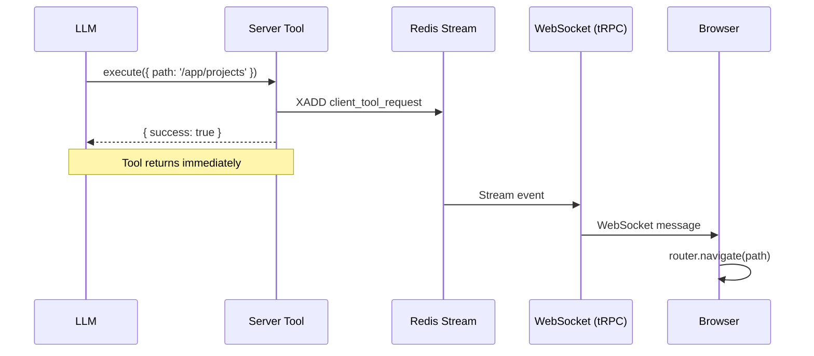
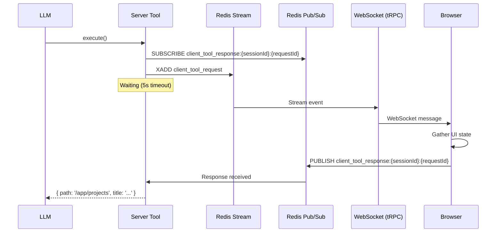

# Client-Side Tool Relaying Architecture

This document describes the architecture for enabling AI agents to execute actions in the user's browser via client-side tools.

## Overview

Client-side tool relaying allows the AI agent to:
- Navigate users to specific pages
- Query the current UI state
- Execute browser-side actions that cannot be performed server-side

## Tool Patterns

The system supports two patterns for client-side tools:

| Pattern | Description | Blocks LLM? | Example |
|---------|-------------|-------------|---------|
| **Fire-and-Forget** | Execute action, return immediately | No | `navigateTo` |
| **Stateful** | Request data, wait for response | Yes (with timeout) | `getCurrentUIState` |

## Architecture Components

### Server-Side

1. **Tool Implementation** - Vercel AI SDK tools that publish events to Redis
2. **Redis Streams** - Transport for server→client events
3. **Redis Pub/Sub** - Transport for client→server responses (stateful tools only)
4. **tRPC Router** - Endpoint for clients to send responses

### Client-Side

1. **Event Subscription** - `useAgentSession` hook receives tool request events
2. **Command Handler** - `useClientToolCommands` hook executes tools
3. **Response Mutation** - tRPC mutation for stateful tool responses

## Fire-and-Forget Flow

Used for tools that don't need confirmation (navigation, scrolling, etc.).



### Characteristics

- Tool returns immediately after publishing event
- No timeout handling needed
- Client executes action without sending response
- Multiple browser tabs will all receive and execute the action

## Stateful (Request-Response) Flow

Used for tools that query client state.



### Characteristics

- Tool blocks until client responds or timeout
- 5-second timeout with graceful error handling
- Client must call tRPC mutation to send response
- Only first response is processed (handles multiple tabs)
- Small delay (50ms) after subscribe to ensure Redis subscription is established before publishing request

## Event Schema

### Client Tool Request Event

Published to Redis Stream, received by client via WebSocket subscription.

```typescript
interface ClientToolRequestEvent {
  type: 'client_tool_request';
  id: string;              // Event ID
  sessionId: string;       // Agent session ID
  messageId: string;       // Current message ID
  timestamp: string;       // ISO timestamp
  toolName: string;        // Tool identifier
  requestId: string;       // UUID for response correlation
  params: Record<string, unknown>;  // Tool-specific parameters
  requiresResponse: boolean;        // Fire-and-forget vs stateful
}
```

### Client Tool Response

Sent by client via tRPC mutation, published to Redis Pub/Sub.

```typescript
interface ClientToolResponse {
  sessionId: string;
  requestId: string;
  response: unknown;  // Tool-specific response data
}
```

## Available Tools

### `navigateTo` (Fire-and-Forget)

Navigate the user's browser to a specific application route.

**Input:**
```typescript
{ path: string }  // Must start with '/'
```

**Output:**
```typescript
{ success: true, message: 'Navigation to /app/projects initiated' }
```

**Example:**
```
Agent: "I'll take you to the projects page."
Tool call: navigateTo({ path: '/app/projects' })
```

### `getCurrentUIState` (Stateful)

Query the current UI state including path, title, and context.

**Input:**
```typescript
{}  // No parameters
```

**Output:**
```typescript
{
  path: string;                      // Current route path
  title: string;                     // Document title
  params: Record<string, string>;    // Route params
  breadcrumbs: string[];             // Navigation breadcrumbs
  activeSection?: string;            // Active sidebar section
}
```

**Example:**
```
Agent: "Let me check what page you're on."
Tool call: getCurrentUIState()
Result: { path: '/app/projects/123', title: 'Project Details', ... }
Agent: "I see you're viewing project 123."
```

## Adding New Client Tools

### 1. Create Tool File

```typescript
// apps/server/src/agent/tools/client-tools/my-tool.ts
import { tool } from 'ai';
import { z } from 'zod';
import type { ClientToolContext } from './types';

export function createMyTool(context: ClientToolContext) {
  return tool({
    description: 'Description for the LLM',
    inputSchema: z.object({ /* params */ }),
    execute: async (params) => {
      // For fire-and-forget:
      await context.sessionManager.publishEvent(context.sessionId, {
        type: 'client_tool_request',
        toolName: 'myTool',
        requestId: crypto.randomUUID(),
        params,
        requiresResponse: false,
      });
      return { success: true };

      // For stateful: see get-current-ui-state.ts for pattern
    },
  });
}
```

### 2. Register Tool

Add to `apps/server/src/agent/tools/index.ts`:
- Add tool ID to `CONTEXT_TOOL_IDS`
- Add case in `getToolsById` switch

### 3. Add Client Handler

Update `apps/web/src/hooks/useClientToolCommands.ts`:
```typescript
case 'myTool': {
  // Execute client-side action
  // For stateful: call respondMutation
  break;
}
```

## Error Handling

### Timeout (Stateful Tools)

If the client doesn't respond within 5 seconds:

```typescript
{ error: 'Client did not respond in time' }
```

The LLM receives this and can retry or inform the user.

### Client Disconnected

Fire-and-forget tools succeed regardless of client connection.
Stateful tools timeout after 5 seconds.

### Invalid Parameters

Tool input schemas validate parameters before execution.
Invalid parameters result in tool execution failure.

## Security Considerations

### Path Validation

The `navigateTo` tool validates paths on both server and client:

**Server-side (Zod schema):**
- Must start with `/` but not `//` or `/\`
- Cannot contain `://` (no protocol injection)
- Uses regex: `/^\/(?![/\\])/`

**Client-side (defense in depth):**
- Same checks repeated before executing navigation
- Logs suspicious paths for monitoring

For highly sensitive applications, consider allowlisting specific path prefixes:
```typescript
const ALLOWED_PREFIXES = ['/app/', '/settings/'];
```

### Prompt Injection

Client-side tools should never:
- Execute arbitrary JavaScript
- Navigate to external URLs
- Access sensitive browser APIs without validation

### Rate Limiting

Consider rate limiting client tool requests to prevent abuse.

## Testing

### Fire-and-Forget Tools

```typescript
// Test that tool returns immediately
const start = Date.now();
const result = await navigateTo({ path: '/app/projects' });
expect(Date.now() - start).toBeLessThan(100); // Should be fast
expect(result.success).toBe(true);
```

### Stateful Tools

```typescript
// Test successful response
// Mock client to respond within timeout

// Test timeout
// Mock client to not respond
// Verify error message returned
```
