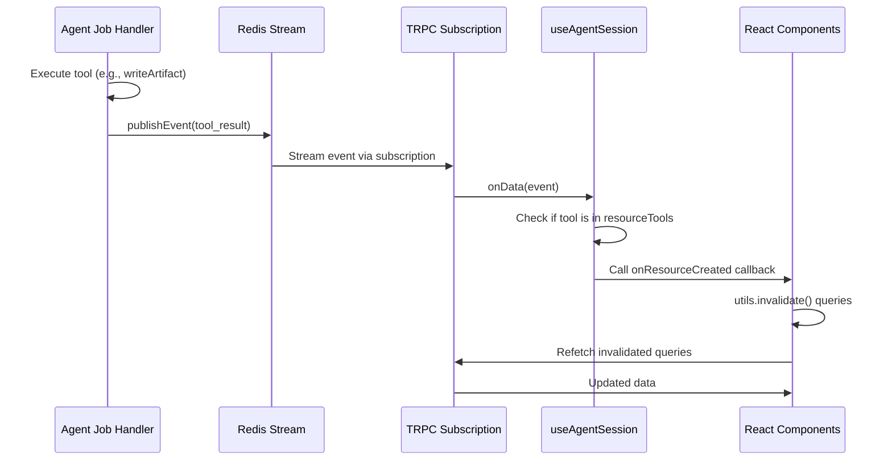
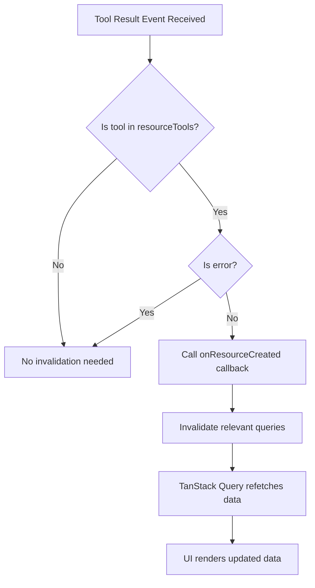

# Cache Invalidation System

This document explains how real-time UI updates work in Agent Kit when data changes on the server.

## Overview

Agent Kit uses **tRPC** with **TanStack Query (React Query)** for client-server communication and caching. When data changes (either from user actions or agent tool calls), the UI must be notified to refetch the updated data.

The system handles two types of data changes:

1. **User-initiated mutations** - Direct API calls from UI interactions
2. **Agent tool-created resources** - Data created by agent tools during streaming sessions

## Architecture

### Event Flow for Tool-Created Resources

When an agent creates a resource (like an artifact) via a tool call, the following flow ensures the UI updates:



### Cache Invalidation Decision Flow



## Cache Invalidation Patterns

The codebase uses three patterns for cache invalidation:

### 1. Manual Invalidation

The most common pattern. After a mutation succeeds, explicitly invalidate related queries:

```typescript
const deleteMutation = trpc.sessions.delete.useMutation({
  onSuccess: () => {
    utils.sessions.list.invalidate();
  },
});
```

**When to use:** For standard CRUD operations where you know exactly which queries need refreshing.

### 2. Optimistic Updates with Rollback

For immediate UI feedback with automatic server sync. Implements a snapshot → update → rollback pattern:

```typescript
const moveTaskMutation = trpc.tasks.move.useMutation({
  onMutate: async ({ id, status, position }) => {
    // 1. Cancel outgoing requests
    await utils.tasks.getByStatus.cancel({ projectId });

    // 2. Snapshot previous data for rollback
    const previousData = utils.tasks.getByStatus.getData({ projectId });

    // 3. Optimistically update cache
    utils.tasks.getByStatus.setData({ projectId }, (old) => {
      // ... update task position
      return newData;
    });

    return { previousData };
  },
  onError: (_err, _variables, context) => {
    // 4. Rollback on error
    if (context?.previousData) {
      utils.tasks.getByStatus.setData({ projectId }, context.previousData);
    }
  },
  onSettled: () => {
    // 5. Refetch to ensure consistency
    utils.tasks.getByStatus.invalidate({ projectId });
  },
});
```

**When to use:** For user interactions that need instant feedback (drag-and-drop, toggles).

### 3. Direct Refetch

Simple pattern using the query's refetch method:

```typescript
const artifactsQuery = trpc.artifacts.list.useQuery({ ... });

const deleteMutation = trpc.artifacts.delete.useMutation({
  onSuccess: () => {
    artifactsQuery.refetch();
  },
});
```

**When to use:** When you have direct access to the query and don't need to invalidate from other components.

## Tool-Created Resources

Agent tools that create resources need special handling since they execute server-side during streaming. The system uses a callback pattern:

### Key Files

| File                                        | Purpose                                                     |
| ------------------------------------------- | ----------------------------------------------------------- |
| `apps/web/src/hooks/useAgentSession.ts`     | Detects resource-creating tools, calls callback             |
| `apps/web/src/components/AppAgentPanel.tsx` | Defines `handleResourceCreated` callback with invalidations |

### Resource Tools List

In `useAgentSession.ts`, the `resourceTools` array defines which tools trigger cache invalidation:

```typescript
const resourceTools = ['writeArtifact', 'webSearch', 'extractContent'];
```

### Invalidation Callback

In `AppAgentPanel.tsx`, the callback invalidates all relevant queries:

```typescript
const handleResourceCreated = useCallback(() => {
  if (sessionId) {
    utils.sessions.getResources.invalidate({ sessionId });
  }
  utils.artifacts.list.invalidate();
}, [sessionId, utils.sessions.getResources, utils.artifacts.list]);
```

## Adding Cache Invalidation for New Resources

To add cache invalidation for a new resource type created by agent tools:

### Step 1: Add Tool to Resource Tools List

In `apps/web/src/hooks/useAgentSession.ts`, add the tool name:

```typescript
const resourceTools = [
  'writeArtifact',
  'webSearch',
  'extractContent',
  'yourNewTool', // Add here
];
```

### Step 2: Add Query Invalidation

In `apps/web/src/components/AppAgentPanel.tsx`, update `handleResourceCreated`:

```typescript
const handleResourceCreated = useCallback(() => {
  if (sessionId) {
    utils.sessions.getResources.invalidate({ sessionId });
  }
  utils.artifacts.list.invalidate();
  utils.yourResource.list.invalidate(); // Add here
}, [
  sessionId,
  utils.sessions.getResources,
  utils.artifacts.list,
  utils.yourResource.list,
]);
```

### Step 3: Ensure Query Exists

Make sure the tRPC router has the corresponding query:

```typescript
// apps/server/src/trpc/routers/your-resource.ts
export const yourResourceRouter = router({
  list: orgProcedure.query(async ({ ctx }) => {
    return ctx.yourFeature.list({ ... });
  }),
});
```

## Current Resource Invalidation Map

| Resource           | Tool(s)          | Queries Invalidated                               |
| ------------------ | ---------------- | ------------------------------------------------- |
| Artifacts          | `writeArtifact`  | `artifacts.list`, `sessions.getResources`         |
| Web Search Results | `webSearch`      | `sessions.getResources`                           |
| Extracted Content  | `extractContent` | `sessions.getResources`                           |
| Sessions           | (user mutations) | `sessions.list`                                   |
| Tasks              | (user mutations) | `tasks.list`, `tasks.getByStatus`, `projects.get` |
| Projects           | (user mutations) | `projects.list`                                   |

## Best Practices

1. **Invalidate broadly, query specifically** - It's better to invalidate more queries than needed; TanStack Query handles deduplication efficiently.

2. **Use invalidate over refetch** - `invalidate()` marks queries as stale; they refetch when needed. `refetch()` forces immediate refetch.

3. **Update dependency arrays** - When adding invalidations to callbacks, update the `useCallback` dependency array.

4. **Consider query parameters** - Some queries need specific params for invalidation:

   ```typescript
   utils.tasks.getByStatus.invalidate({ projectId }); // Specific
   utils.artifacts.list.invalidate(); // All variants
   ```

5. **Test the full flow** - After adding invalidation, test by:
   - Creating a resource via agent tool
   - Navigating to the list page
   - Verifying the new resource appears without manual refresh
