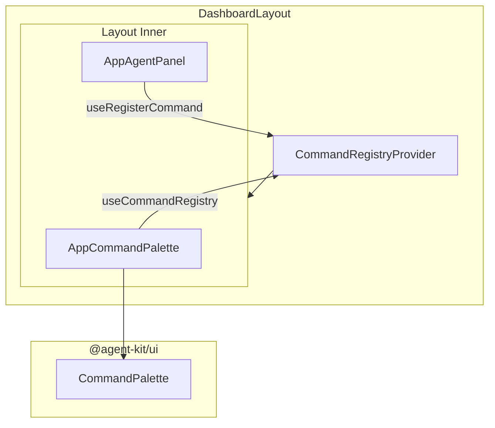
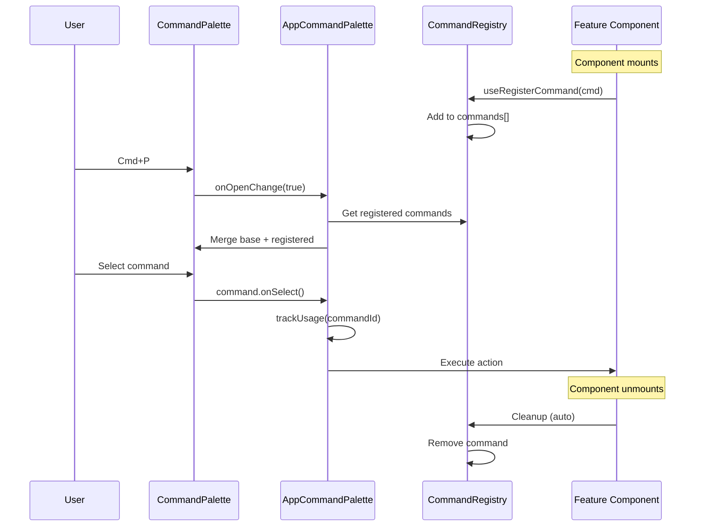
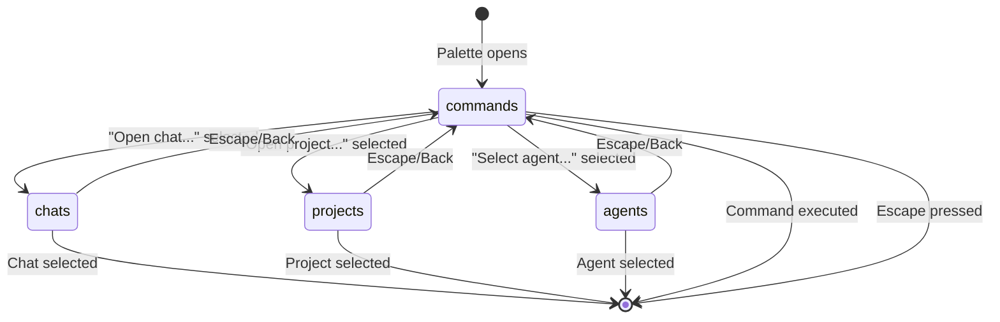

# Command Palette Architecture

This document explains the command palette system in Agent Kit, including how to add new commands and use the two-step flow pattern.

## Overview

The command palette provides quick keyboard-driven access to application features. Press `Cmd+P` (Mac) or `Ctrl+P` (Windows/Linux) to open it.

**Features:**

- **Global commands** - Navigation, theme toggle, panel controls
- **Dynamic commands** - Registered by components when mounted
- **Two-step flows** - Commands that open sub-lists (chats, projects, agents)
- **Usage tracking** - Most recently used commands appear first

## Architecture

### Component Hierarchy



### Data Flow



### Two-Step Flow State Machine



## Key Files

| File                                                  | Purpose                                    |
| ----------------------------------------------------- | ------------------------------------------ |
| `apps/web/src/components/AppCommandPalette.tsx`       | Main command palette with base commands    |
| `apps/web/src/contexts/CommandRegistryContext.tsx`    | Dynamic command registration context       |
| `apps/web/src/layouts/DashboardLayout.tsx`            | Layout with state management and callbacks |
| `packages/ui/src/components/CommandPalette/types.ts`  | Command type definitions                   |
| `packages/ui/src/components/CommandPalette/index.tsx` | CommandPalette UI component                |

## Command Types

### Base Commands

Defined in `AppCommandPalette.tsx` in the `baseCommands` array. These are always available.

```typescript
const baseCommands = useMemo<Command[]>(
  () => [
    {
      id: 'new-chat',
      label: 'Create new chat',
      description: 'Start a fresh conversation',
      icon: <Plus className="h-4 w-4" />,
      keywords: ['new', 'chat', 'conversation', 'create'],
      onSelect: () => {
        trackUsage('new-chat');
        clearSession();
        navigate('/app');
      },
    },
    // ...more commands
  ],
  [
    /* dependencies */
  ]
);
```

### Dynamic Commands

Registered by components using `useRegisterCommand`. Automatically cleaned up on unmount.

```typescript
import { useRegisterCommand } from '../contexts/CommandRegistryContext';

function MyFeature() {
  const command = useMemo(
    () => ({
      id: 'my-feature-action',
      label: 'Do something',
      description: 'Performs an action',
      icon: <Star className="h-4 w-4" />,
      keywords: ['action', 'do'],
      onSelect: () => {
        // action logic
      },
      disabled: !isReady,
    }),
    [isReady]
  );

  useRegisterCommand(command);

  return <div>...</div>;
}
```

### Two-Step Commands

Commands that open a sub-list instead of executing immediately.

```typescript
{
  id: 'open-chat',
  label: 'Open chat...',
  description: 'Select from recent chats',
  icon: <MessageSquare className="h-4 w-4" />,
  disabled: sessions.length === 0,
  keepOpen: true,  // Prevents palette from closing
  onSelect: () => {
    setMode('chats');  // Switch to chat list
  },
}
```

## Two-Step Flow Pattern

### Implementation

```typescript
type PaletteMode = 'commands' | 'chats' | 'projects' | 'agents';
const [mode, setMode] = useState<PaletteMode>('commands');

// Reset on close
useEffect(() => {
  if (!open) {
    setMode('commands');
  }
}, [open]);

// Choose commands based on mode
const commands = useMemo(() => {
  switch (mode) {
    case 'chats':
      return chatCommands;
    case 'projects':
      return projectCommands;
    case 'agents':
      return agentCommands;
    default:
      return sortedBaseCommands;
  }
}, [mode /* ... */]);
```

## Usage Tracking

Commands track their last usage timestamp for recency-based sorting:

```typescript
const USAGE_STORAGE_KEY = 'agent-kit:command-palette-usage';

const trackUsage = useCallback((commandId: string) => {
  setUsage((prev) => {
    const updated = { ...prev, [commandId]: Date.now() };
    saveUsage(updated); // localStorage
    return updated;
  });
}, []);

// Sort by most recently used
const sortedCommands = allCommands.sort((a, b) => {
  const aUsage = usage[a.id] ?? 0;
  const bUsage = usage[b.id] ?? 0;
  return bUsage - aUsage;
});
```

## Adding New Commands

### Adding a Base Command

1. Add to `baseCommands` array in `AppCommandPalette.tsx`:

```typescript
{
  id: 'my-command',
  label: 'My command',
  description: 'Does something useful',
  icon: <Icon className="h-4 w-4" />,
  keywords: ['my', 'command', 'useful'],
  onSelect: () => {
    trackUsage('my-command');
    // action
  },
}
```

2. If command needs layout state, add a callback prop:

```typescript
// AppCommandPaletteProps
onMyAction?: () => void;

// baseCommands (conditional)
...(onMyAction ? [{
  id: 'my-command',
  // ...
  onSelect: () => {
    trackUsage('my-command');
    onMyAction();
  },
}] : []),

// DashboardLayout
<AppCommandPalette onMyAction={handleMyAction} />
```

### Adding a Two-Step Flow

1. Extend `PaletteMode`:

```typescript
type PaletteMode = 'commands' | 'chats' | 'projects' | 'agents' | 'myItems';
```

2. Create items command array:

```typescript
const myItemCommands = useMemo<Command[]>(() => {
  return myItems.map((item) => ({
    id: `item-${item.id}`,
    label: item.name,
    icon: <Icon className="h-4 w-4" />,
    onSelect: () => {
      trackUsage('select-item');
      onItemSelect(item);
    },
  }));
}, [myItems, onItemSelect, trackUsage]);
```

3. Add trigger command:

```typescript
{
  id: 'select-item',
  label: 'Select item...',
  keepOpen: true,
  onSelect: () => setMode('myItems'),
}
```

4. Update switch statements for commands, placeholder, emptyMessage.

### Adding a Dynamic Command

Use `useRegisterCommand` in any component within `CommandRegistryProvider`:

```typescript
import { useRegisterCommand } from '../contexts/CommandRegistryContext';

function MyFeature() {
  const command = useMemo(
    () => ({
      id: 'my-feature-action',
      label: 'Feature action',
      description: 'Available only when feature is active',
      icon: <Icon className="h-4 w-4" />,
      keywords: ['feature'],
      onSelect: () => {
        // action
      },
      disabled: !isReady,
    }),
    [isReady]
  );

  useRegisterCommand(command);

  return <div>...</div>;
}
```

## Focus Management

Commands can specify a focus target for after the palette closes:

```typescript
{
  id: 'focus-chat-input',
  label: 'Focus chat input',
  onSelect: () => {},  // No-op, focus is handled separately
  getFocusTarget: () => inputRef.current,
}
```

The `CommandPalette` component will focus this element instead of restoring focus to the trigger.

## Best Practices

1. **Use descriptive keywords** - Include synonyms and related terms
2. **Track usage** - Call `trackUsage(commandId)` in every command
3. **Conditional availability** - Use `disabled` for temporary unavailability, conditional rendering for permanent
4. **Icon consistency** - Use 4x4 icons from lucide-react
5. **Memoize commands** - Use `useMemo` to prevent unnecessary re-renders
6. **Clean up dynamic commands** - `useRegisterCommand` handles this automatically

## Current Commands

| Command               | Description                       | Type     |
| --------------------- | --------------------------------- | -------- |
| Create new chat       | Start a fresh conversation        | Base     |
| Open chat...          | Select from recent chats          | Two-step |
| Open project...       | Select from your projects         | Two-step |
| Select agent...       | Choose an agent for new chat      | Two-step |
| Navigate to home      | Go to the dashboard               | Base     |
| Navigate to artifacts | View all artifacts                | Base     |
| Navigate to projects  | View all projects                 | Base     |
| Navigate to agents    | Manage local agents               | Base     |
| Navigate to analytics | View usage analytics              | Base     |
| Navigate to users     | Manage team members               | Base     |
| Toggle theme          | Switch between light/dark mode    | Base     |
| Open previous chat    | Open the last active chat         | Base     |
| Go back/forward       | Navigate browser history          | Base     |
| Toggle chat panel     | Show/hide the assistant panel     | Base     |
| Toggle chat history   | Show/hide the history sidebar     | Base     |
| Split panel 50/50     | Equal width for content and panel | Base     |
| Split panel 40/60     | Wider content, narrower panel     | Base     |
| Focus chat input      | Move cursor to the chat input     | Dynamic  |
