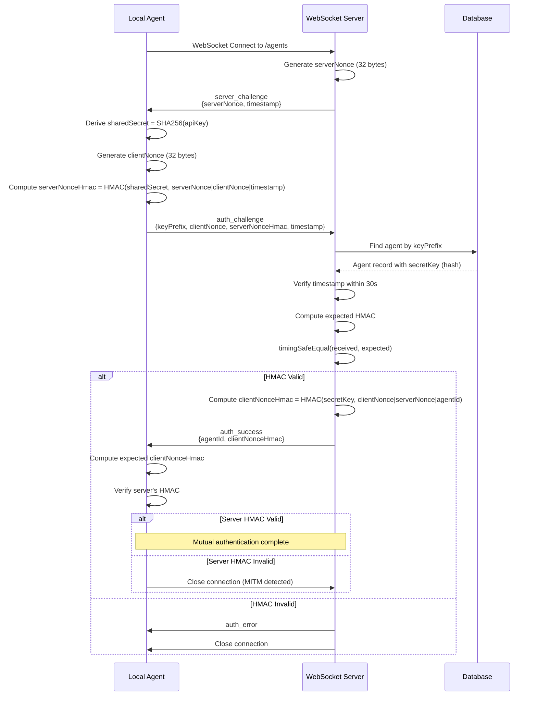

# Local Agent Authentication

This document describes the HMAC mutual authentication protocol used for secure communication between local agents and the Agent Kit server.

## Overview

Local agents connect to the server via WebSocket. The authentication protocol ensures:

1. **Agent Identity**: Server verifies the agent knows the secret API key
2. **Server Identity**: Agent verifies the server has access to the stored credentials
3. **Transport Security**: WSS (TLS) required for non-localhost connections

This prevents man-in-the-middle attacks where an attacker could intercept the connection and impersonate either party.

## Protocol Flow

```
Agent                                      Server
  |                                           |
  |-------- WebSocket Connect --------------->|
  |                                           |
  |<-------- server_challenge ----------------|
  |   { type, serverNonce, timestamp }        |
  |                                           |
  |-------- auth_challenge ------------------>|
  |   { type, keyPrefix, clientNonce,         |
  |     serverNonceHmac, timestamp }          |
  |                                           |
  |<-------- auth_success --------------------|
  |   { type, agentId, clientNonceHmac }      |
  |                                           |
  |   [Agent verifies clientNonceHmac]        |
  |   [Connection authenticated]              |
```

### Step 1: WebSocket Connection

Agent initiates a WebSocket connection to the server's `/agents` endpoint.

### Step 2: Server Challenge

Immediately upon connection, the server sends a challenge:

```typescript
{
  type: 'server_challenge',
  serverNonce: string,  // 32-byte random hex string
  timestamp: number     // Unix timestamp in milliseconds
}
```

### Step 3: Agent Response

The agent responds with its own challenge and proof of identity:

```typescript
{
  type: 'auth_challenge',
  keyPrefix: string,       // First 20 chars of API key + "..."
  clientNonce: string,     // 32-byte random hex string
  serverNonceHmac: string, // HMAC proving agent identity
  timestamp: number        // Unix timestamp in milliseconds
}
```

The `serverNonceHmac` is computed as:

```
HMAC-SHA256(sharedSecret, serverNonce|clientNonce|timestamp)
```

### Step 4: Server Verification & Response

The server:

1. Looks up the agent by `keyPrefix`
2. Verifies the timestamp is within 30 seconds
3. Verifies the `serverNonceHmac` using the stored secret
4. Computes its own HMAC to prove server identity

```typescript
{
  type: 'auth_success',
  agentId: string,         // UUID of the authenticated agent
  clientNonceHmac: string  // HMAC proving server identity
}
```

The `clientNonceHmac` is computed as:

```
HMAC-SHA256(sharedSecret, clientNonce|serverNonce|agentId)
```

### Step 5: Agent Verification

The agent verifies `clientNonceHmac` matches its expected value. If verification fails, the agent closes the connection with an error (possible MITM attack).

## Security Analysis

### How the Server Knows the Agent is Legitimate

1. Agent receives `server_challenge` with random `serverNonce`
2. Agent computes HMAC using `SHA256(plaintextKey)` as the secret
3. Server retrieves stored `secretKey` (which is `SHA256(plaintextKey)`)
4. Server computes the same HMAC and compares

**Why this works**: Only someone who knows the plaintext API key can compute `SHA256(plaintextKey)`. The HMAC can only be forged by someone with access to this value.

### How the Agent Knows the Server is Legitimate

1. Agent sends `auth_challenge` with random `clientNonce`
2. Server computes HMAC using stored `secretKey`
3. Agent computes expected HMAC using `SHA256(plaintextKey)`
4. Agent compares received HMAC with expected value

**Why this works**: Only the legitimate server has access to the database containing `SHA256(plaintextKey)`. A MITM attacker cannot compute the correct HMAC without database access.

### Shared Secret Derivation

```
Agent knows:     plaintextKey = "ak_local_abc123..."
Agent derives:   sharedSecret = SHA256(plaintextKey)

Server stores:   secretKey = SHA256(plaintextKey)  // Same value!
```

Both parties can compute identical HMACs because they both have access to `SHA256(plaintextKey)`:

- Agent derives it from the plaintext key it was given at registration
- Server retrieves it from the database where it was stored at registration

## Additional Security Properties

### Replay Prevention

Each handshake uses fresh random nonces (32 bytes of entropy). Even if an attacker captures a valid handshake, they cannot replay it because:

- The `serverNonce` changes with each connection
- The `clientNonce` changes with each connection
- The HMAC includes both nonces

### Timing Attack Resistance

All HMAC comparisons use `crypto.timingSafeEqual()` to prevent timing-based side-channel attacks.

### Timestamp Validation

Challenges are rejected if the timestamp is more than 30 seconds old, limiting the window for replay attacks.

### Transport Security (WSS)

The agent enforces WSS (WebSocket Secure / TLS) for all non-localhost connections:

```typescript
const url = new URL(serverUrl);
const isLocalhost = ['localhost', '127.0.0.1', '::1'].includes(url.hostname);
const isSecure = url.protocol === 'wss:';

if (!isLocalhost && !isSecure) {
  throw new Error('Security error: WSS required for non-localhost connections');
}
```

This provides:

- Encryption of all traffic
- Server certificate validation
- Protection against passive eavesdropping

## Message Types

### ServerChallenge

```typescript
interface ServerChallenge {
  type: 'server_challenge';
  serverNonce: string; // 64 hex chars (32 bytes)
  timestamp: number; // Unix ms
}
```

### AuthChallenge

```typescript
interface AuthChallenge {
  type: 'auth_challenge';
  keyPrefix: string; // e.g., "ak_local_12345678..."
  clientNonce: string; // 64 hex chars (32 bytes)
  serverNonceHmac: string; // 64 hex chars (32 bytes)
  timestamp: number; // Unix ms
}
```

### AuthSuccess

```typescript
interface AuthSuccess {
  type: 'auth_success';
  agentId: string; // UUID
  clientNonceHmac: string; // 64 hex chars (32 bytes)
}
```

### AuthError

```typescript
interface AuthError {
  type: 'auth_error';
  error: string;
}
```

## Error Handling

| Error                          | Cause                         | Resolution                           |
| ------------------------------ | ----------------------------- | ------------------------------------ |
| `Expected auth_challenge`      | Agent sent wrong message type | Check agent version                  |
| `Missing required auth fields` | Malformed auth_challenge      | Check agent implementation           |
| `Challenge expired`            | Timestamp > 30s old           | Check system clocks are synced       |
| `Invalid credentials`          | Key prefix not found          | Check API key, agent may be disabled |
| `Authentication failed`        | HMAC verification failed      | Check API key is correct             |
| `Server verification failed`   | Agent couldn't verify server  | Possible MITM attack                 |

## Implementation Files

| Component                | File                                                            |
| ------------------------ | --------------------------------------------------------------- |
| Server auth utilities    | `apps/server/src/agent/local-agent-auth.ts`                     |
| Server WebSocket handler | `apps/server/src/agent/local-agent-websocket-service.ts`        |
| Agent key lookup         | `apps/server/src/features/local-agents/local-agents-feature.ts` |
| Client auth utilities    | `apps/local-agent/src/lib/auth.ts`                              |
| Client connection        | `apps/local-agent/src/lib/client.ts`                            |

## Sequence Diagram


