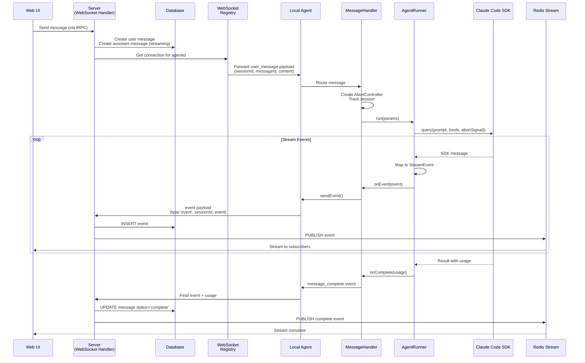
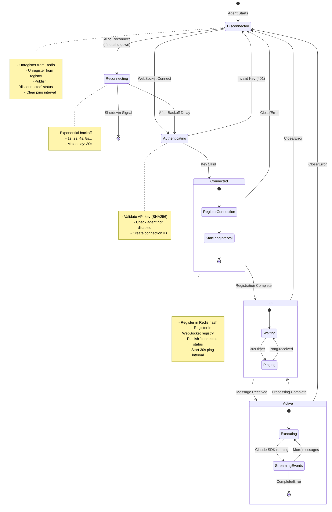
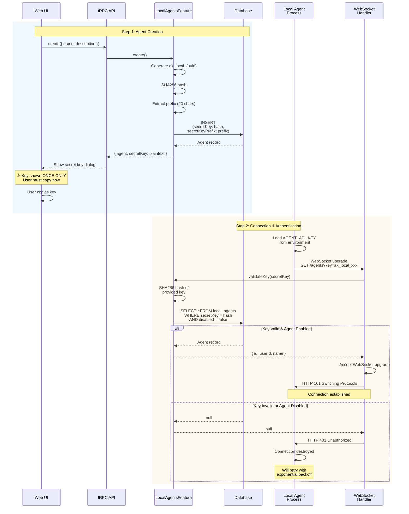
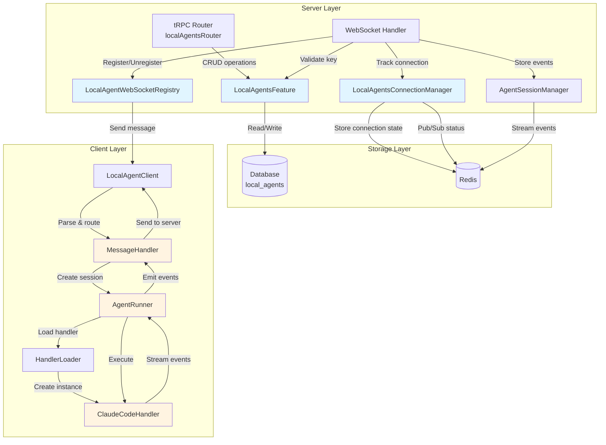
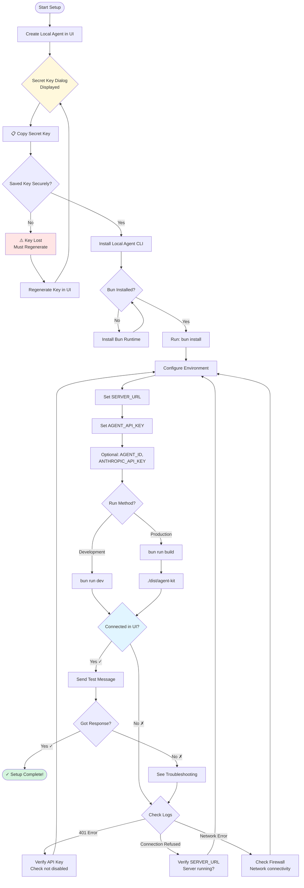
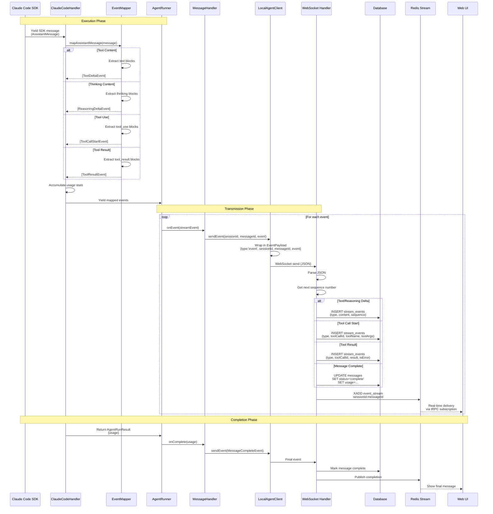

# Local Agents

## Table of Contents

- [Introduction](#introduction)
- [Architecture Overview](#architecture-overview)
- [System Diagrams](#system-diagrams)
- [Quick Start Guide](#quick-start-guide)
- [Detailed Setup Instructions](#detailed-setup-instructions)
- [Technical Details](#technical-details)
- [Development Guide](#development-guide)
- [Troubleshooting](#troubleshooting)
- [API Reference](#api-reference)

## Introduction

Local agents are AI-powered assistants that run as independent processes on your local machine or remote servers, connecting to the Agent Kit server via WebSocket. They provide secure, sandboxed access to your file system and local environment while maintaining full control over what operations are permitted.

### What Are Local Agents?

Local agents are subprocesses/workers that:

- Run independently on your machine as separate Node.js processes
- Connect to the Agent Kit server using WebSocket for bidirectional communication
- Execute AI-powered queries using the Claude Code SDK
- Have **read-only access** to your file system and environment
- Stream results back to the server in real-time

### Key Capabilities

- **File System Access**: Read files, search directories, and explore codebases
- **Secure Execution**: Read-only agents restricted to tools (Read, Glob, Grep, WebFetch, WebSearch)
- **Full Coding Agent**: Claude CLI agent with full file system access (Read, Write, Edit, Bash, etc.)
- **Real-time Streaming**: Events stream back to the UI as they occur
- **Connection Management**: Automatic reconnection with exponential backoff
- **Multi-user Support**: Each user can create and manage multiple local agents

### Agent Types

| Agent                   | Description                          | Tools                                     |
| ----------------------- | ------------------------------------ | ----------------------------------------- |
| **Codebase Researcher** | Read-only codebase exploration       | Read, Glob, Grep                          |
| **Web Researcher**      | Web search and information gathering | WebFetch, WebSearch                       |
| **Claude CLI**          | Full-featured coding agent           | All tools (Read, Write, Edit, Bash, etc.) |
| **Mock Agent**          | Testing and development              | Simulated tools                           |

### Use Cases

- **Code Analysis**: Analyze codebases without uploading files to the cloud
- **Local Development**: Run agents with access to your development environment
- **Private Data**: Process sensitive files that must stay on your machine
- **Custom Tools**: Extend agents with local-only capabilities
- **Remote Execution**: Deploy agents on remote servers for distributed processing

## Architecture Overview

The local agent system uses a WebSocket-based architecture where agents running on user machines connect to the central server, authenticate using API keys, and process messages by interacting with the Claude Code SDK.

### System Components

| Component                        | Location                                                                   | Purpose                                                |
| -------------------------------- | -------------------------------------------------------------------------- | ------------------------------------------------------ |
| **Web UI**                       | `apps/web`                                                                 | User interface for creating and managing local agents  |
| **tRPC API**                     | `apps/server/src/trpc/routers/local-agents.ts`                             | RESTful API for agent CRUD operations                  |
| **WebSocket Handler**            | `apps/server/src/index.ts`                                                 | WebSocket server for agent connections                 |
| **LocalAgentsFeature**           | `apps/server/src/features/local-agents/local-agents-feature.ts`            | Business logic for agent management and authentication |
| **LocalAgentsConnectionManager** | `apps/server/src/features/local-agents/local-agents-connection-manager.ts` | Redis-based connection state tracking                  |
| **LocalAgentWebSocketRegistry**  | `apps/server/src/features/local-agents/local-agent-websocket-registry.ts`  | In-memory registry of active WebSocket connections     |
| **Local Agent Client**           | `apps/local-agent/src/index.ts`                                            | WebSocket client running on user's machine             |
| **MessageHandler**               | `apps/local-agent/src/message-handler.ts`                                  | Routes messages and manages sessions                   |
| **AgentRunner**                  | `apps/local-agent/src/agent-runner.ts`                                     | Orchestrates Claude SDK execution                      |
| **ClaudeCodeHandler**            | `apps/local-agent/src/handlers/claude-code.ts`                             | Wraps Claude Code SDK and maps events                  |

### Security Model

**Authentication**:

- API keys use format: `ak_local_{uuid}`
- Keys are SHA256 hashed before storage in database
- Only the first 20 characters (prefix) are displayed in the UI
- Plaintext keys are shown once at creation time only
- Keys cannot be recovered, only regenerated

**Tool Restrictions**:

- Agents are limited to **read-only tools**: Read, Glob, Grep, WebFetch, WebSearch
- No write operations: Write, Edit, Bash, or other modifying tools are disabled
- This ensures agents cannot modify the file system or execute arbitrary commands

**Connection Security**:

- Each connection is validated on WebSocket handshake
- Invalid or disabled agents are rejected with 401 Unauthorized
- Connections are tracked in Redis for distributed systems
- Ping/pong keepalive detects and cleans up stale connections

## System Diagrams

### Diagram 1: Overall System Architecture

```mermaid
graph TB
    subgraph "Web Browser"
        UI[React UI<br/>AgentsPage]
        WS1[WebSocket Client<br/>tRPC Subscription]
    end

    subgraph "Server"
        API[tRPC API<br/>localAgentsRouter]
        WSH[WebSocket Handler<br/>/agents endpoint]
        LAF[LocalAgentsFeature<br/>CRUD + Auth]
        LACM[LocalAgentsConnectionManager<br/>Redis State]
        LAWR[LocalAgentWebSocketRegistry<br/>Active Connections]
        SM[AgentSessionManager<br/>Message Storage]
    end

    subgraph "Redis"
        HASH[Hash: Connections<br/>by userId]
        PS[Pub/Sub: Status<br/>Updates]
        STREAM[Streams: Events<br/>Real-time Delivery]
    end

    subgraph "Local Machine"
        LAC[LocalAgentClient<br/>WebSocket Client]
        MH[MessageHandler<br/>Message Router]
        AR[AgentRunner<br/>Orchestrator]
        CCH[ClaudeCodeHandler<br/>SDK Wrapper]
        SDK[Claude Code SDK]
    end

    subgraph "Database"
        DB[(PostgreSQL<br/>local_agents table)]
    end

    UI -->|Create/Manage| API
    API -->|CRUD| LAF
    LAF -->|Store| DB

    UI <-->|Subscribe| WS1
    WS1 <-->|Status Updates| PS
    WS1 <-->|Event Stream| STREAM

    LAC -->|?key=ak_local_xxx| WSH
    WSH -->|Validate Key| LAF
    LAF -->|Query| DB
    WSH -->|Register| LAWR
    WSH -->|Track| LACM
    LACM -->|Store| HASH
    LACM -->|Publish| PS

    WSH <-->|Bidirectional<br/>Messages| LAWR
    LAWR <-->|Forward| LAC
    LAC -->|Parse| MH
    MH -->|Execute| AR
    AR -->|Run| CCH
    CCH -->|query()| SDK
    SDK -->|Messages| CCH
    CCH -->|Map Events| AR
    AR -->|StreamEvents| MH
    MH -->|JSON| LAC
    LAC -->|WebSocket| WSH
    WSH -->|Store| SM
    SM -->|Publish| STREAM
```

### Diagram 2: Message Flow - User Message



### Diagram 3: Connection Lifecycle



### Diagram 4: Authentication Flow



### Diagram 5: Component Interactions



### Diagram 6: Setup Checklist Flow



### Diagram 7: Event Streaming Flow



## Quick Start Guide

### Prerequisites

Before setting up a local agent, ensure you have:

1. **Bun runtime** installed (version 1.2.0 or higher)

   ```bash
   curl -fsSL https://bun.sh/install | bash
   ```

2. **Agent Kit server** running and accessible
3. **User account** with access to the Agent Kit web interface
4. **Anthropic API key** (for Claude SDK access)

### Step 1: Create a Local Agent

1. Navigate to the **Agents** page in the web UI
2. Click **"Create Agent"** or **"New Local Agent"**
3. Fill in the agent details:
   - **Name**: A descriptive name for your agent (e.g., "My Laptop Agent")
   - **Description**: Optional details about what this agent is for
4. Click **"Create"**
5. **IMPORTANT**: A dialog will appear showing your secret API key (`ak_local_...`)
   - Copy this key immediately
   - Store it securely (password manager, encrypted file, etc.)
   - You will **never see this key again**
   - If lost, you must regenerate it (invalidating the old one)

### Step 2: Install the Local Agent CLI

1. Clone or navigate to the Agent Kit repository:

   ```bash
   cd /path/to/agent-kit
   ```

2. Navigate to the local agent directory:

   ```bash
   cd apps/local-agent
   ```

3. Install dependencies:
   ```bash
   bun install
   ```

### Step 3: Configure Environment

Create a `.env` file or set environment variables:

```bash
# Required: WebSocket server URL
SERVER_URL=ws://localhost:3000

# Required: Secret key from Step 1
AGENT_API_KEY=ak_local_xxxxxxxx-xxxx-xxxx-xxxx-xxxxxxxxxxxx

# Required: Anthropic API key for Claude SDK
ANTHROPIC_API_KEY=sk-ant-...

# Optional: Agent identifier for logging
AGENT_ID=my-laptop-agent
```

**Environment variable details:**

- `SERVER_URL`: WebSocket endpoint (use `ws://` for development, `wss://` for production)
- `AGENT_API_KEY`: The secret key you copied in Step 1
- `ANTHROPIC_API_KEY`: Your Anthropic API key for Claude access
- `AGENT_ID`: Optional identifier shown in logs

### Step 4: Run the Agent

**Development mode** (with hot reload):

```bash
bun run dev
```

**Production mode** (compiled binary):

```bash
# Build the binary
bun run build

# Run the binary
./dist/agent-kit
```

You should see output like:

```
[INFO] Local agent initializing...
[INFO] Node version: v20.x.x
[INFO] Working directory: /path/to/your/directory
[INFO] Allowed tools: Read, Glob, Grep, WebFetch, WebSearch
[INFO] Connecting to server: ws://localhost:3000
[INFO] WebSocket connection established
[INFO] Agent connected successfully
```

### Step 5: Verify Connection

1. Go back to the **Agents** page in the web UI
2. Find your agent in the list
3. Check the status badge:

   - **Connected** (green with pulse animation) = Agent is online
   - **Offline** (gray) = Agent is not connected
   - **Disabled** (red) = Agent is disabled

4. Create a new chat session:
   - Go to the **Chat** page
   - Select your local agent from the agent dropdown
   - Send a test message: _"What files are in my current directory?"_
   - Verify you receive a response listing your files

If you see the **Connected** badge and receive responses, your local agent is working correctly!

## Detailed Setup Instructions

### Environment Variables Reference

| Variable            | Required | Description                      | Example                                                |
| ------------------- | -------- | -------------------------------- | ------------------------------------------------------ |
| `SERVER_URL`        | Yes      | WebSocket server URL             | `ws://localhost:3000` or `wss://agent-kit.example.com` |
| `AGENT_API_KEY`     | Yes      | Secret key from agent creation   | `ak_local_12345678-1234-1234-1234-123456789abc`        |
| `ANTHROPIC_API_KEY` | Yes      | Anthropic API key for Claude SDK | `sk-ant-api03-...`                                     |
| `AGENT_ID`          | No       | Custom identifier for logs       | `my-laptop`, `work-server`, etc.                       |

### Building the Agent Binary

The local agent can be compiled into a standalone executable:

```bash
cd apps/local-agent
bun run build
```

This creates a binary at `./dist/agent-kit` that includes:

- All TypeScript code compiled to native binary
- Bun runtime embedded
- All dependencies bundled
- No need for `node_modules` or source files

The binary is portable and can be copied to other machines with the same architecture.

### Running in Development

For development with automatic reload on code changes:

```bash
cd apps/local-agent
bun run dev
```

This uses `bun run --watch` to restart the process when files change. Useful for:

- Testing changes to handlers
- Debugging connection issues
- Developing new features

### Running in Production

For production deployments:

1. **Build the binary**:

   ```bash
   bun run build
   ```

2. **Copy the binary** to your target machine:

   ```bash
   scp dist/agent-kit user@server:/usr/local/bin/
   ```

3. **Set environment variables** on the target machine:

   ```bash
   export SERVER_URL=wss://agent-kit.example.com
   export AGENT_API_KEY=ak_local_xxx
   export ANTHROPIC_API_KEY=sk-ant-xxx
   ```

4. **Run the binary**:
   ```bash
   /usr/local/bin/agent-kit
   ```

### Running as a Service

#### systemd (Linux)

Create `/etc/systemd/system/agent-kit.service`:

```ini
[Unit]
Description=Agent Kit Local Agent
After=network.target

[Service]
Type=simple
User=your-username
WorkingDirectory=/home/your-username
Environment="SERVER_URL=wss://agent-kit.example.com"
Environment="AGENT_API_KEY=ak_local_xxx"
Environment="ANTHROPIC_API_KEY=sk-ant-xxx"
Environment="AGENT_ID=production-server"
ExecStart=/usr/local/bin/agent-kit
Restart=always
RestartSec=10

[Install]
WantedBy=multi-user.target
```

Enable and start:

```bash
sudo systemctl enable agent-kit
sudo systemctl start agent-kit
sudo systemctl status agent-kit
```

#### launchd (macOS)

Create `~/Library/LaunchAgents/com.agent-kit.local-agent.plist`:

```xml
<?xml version="1.0" encoding="UTF-8"?>
<!DOCTYPE plist PUBLIC "-//Apple//DTD PLIST 1.0//EN" "http://www.apple.com/DTDs/PropertyList-1.0.dtd">
<plist version="1.0">
<dict>
    <key>Label</key>
    <string>com.agent-kit.local-agent</string>
    <key>ProgramArguments</key>
    <array>
        <string>/usr/local/bin/agent-kit</string>
    </array>
    <key>EnvironmentVariables</key>
    <dict>
        <key>SERVER_URL</key>
        <string>wss://agent-kit.example.com</string>
        <key>AGENT_API_KEY</key>
        <string>ak_local_xxx</string>
        <key>ANTHROPIC_API_KEY</key>
        <string>sk-ant-xxx</string>
    </dict>
    <key>RunAtLoad</key>
    <true/>
    <key>KeepAlive</key>
    <true/>
    <key>StandardOutPath</key>
    <string>/tmp/agent-kit.log</string>
    <key>StandardErrorPath</key>
    <string>/tmp/agent-kit-error.log</string>
</dict>
</plist>
```

Load and start:

```bash
launchctl load ~/Library/LaunchAgents/com.agent-kit.local-agent.plist
launchctl start com.agent-kit.local-agent
```

#### PM2 (Cross-platform)

Using [PM2](https://pm2.keymetrics.io/) process manager:

```bash
# Install PM2
npm install -g pm2

# Start the agent
pm2 start agent-kit --name "local-agent" \
  --env SERVER_URL="wss://agent-kit.example.com" \
  --env AGENT_API_KEY="ak_local_xxx" \
  --env ANTHROPIC_API_KEY="sk-ant-xxx"

# Save the process list
pm2 save

# Setup PM2 to start on boot
pm2 startup
```

View logs:

```bash
pm2 logs local-agent
```

## Technical Details

### WebSocket Protocol Specification

#### Connection

- **Endpoint**: `/agents`
- **Protocol**: WebSocket (ws:// or wss://)
- **Authentication**: Query parameter `?key={AGENT_API_KEY}`
- **Example**: `ws://localhost:3000/agents?key=ak_local_xxx`

#### Handshake

1. Client sends HTTP upgrade request with `Upgrade: websocket` header
2. Server validates API key:
   - Hash provided key with SHA256
   - Query database for matching hash
   - Check agent is not disabled
3. If valid: Server responds with `101 Switching Protocols`
4. If invalid: Server responds with `401 Unauthorized`

#### Keepalive

- **Server → Client**: Ping every 30 seconds
- **Client → Server**: Pong response expected
- **Timeout**: Connection considered stale if pong not received
- **Cleanup**: Stale connections are closed and unregistered

#### Reconnection

- **Trigger**: Connection loss (error, close, timeout)
- **Strategy**: Exponential backoff
- **Delays**: 1s, 2s, 4s, 8s, 16s, 30s (max)
- **Shutdown**: On SIGINT/SIGTERM, agent stops reconnecting

### Message Types

#### Server → Agent Messages

**1. User Message**

Sent when a user submits a message to the agent:

```typescript
{
  type: 'user_message',
  sessionId: string,        // UUID of chat session
  messageId: string,        // UUID of assistant message (for event association)
  userMessageId: string,    // UUID of user's message
  content: string,          // The prompt/question from user
  userId: string,           // User who sent the message
  timestamp: string         // ISO 8601 timestamp
}
```

**2. Interrupt**

Sent when a user cancels an in-progress message:

```typescript
{
  type: 'interrupt',
  sessionId: string,        // UUID of session to interrupt
  timestamp: string         // ISO 8601 timestamp
}
```

#### Agent → Server Messages

**Event Payload**

All events are wrapped in this payload:

```typescript
{
  type: 'event',
  sessionId: string,        // UUID of session
  messageId: string,        // UUID of message
  event: StreamEvent        // One of the event types below
}
```

### Event Types with Payload Schemas

**1. Message Start**

Emitted at the beginning of agent execution:

```typescript
{
  type: 'message_start';
}
```

**2. Text Delta**

Emitted for each chunk of text content:

```typescript
{
  type: 'text_delta',
  delta: string             // Text chunk to append
}
```

**3. Reasoning Delta**

Emitted for each chunk of thinking/reasoning:

```typescript
{
  type: 'reasoning_delta',
  delta: string             // Reasoning chunk to append
}
```

**4. Tool Call Start**

Emitted when a tool is invoked:

```typescript
{
  type: 'tool_call_start',
  toolCallId: string,       // Unique identifier for this tool call
  toolName: string,         // Name of tool (Read, Glob, Grep, etc.)
  toolArgs?: Record<string, unknown>  // Tool arguments
}
```

**5. Tool Call Args Delta**

Emitted for streaming tool arguments (if args are large):

```typescript
{
  type: 'tool_call_args_delta',
  toolCallId: string,       // Matches tool_call_start
  delta: string             // Argument chunk to append
}
```

**6. Tool Result**

Emitted when a tool execution completes:

```typescript
{
  type: 'tool_result',
  toolCallId: string,       // Matches tool_call_start
  result: unknown,          // Tool output (varies by tool)
  isError?: boolean         // True if tool execution failed
}
```

**7. Message Complete**

Emitted when agent execution finishes:

```typescript
{
  type: 'message_complete',
  usage?: {
    promptTokens: number,
    completionTokens: number,
    estimatedCost?: number
  },
  finishReason?: string     // 'end_turn', 'max_tokens', etc.
}
```

**8. Error**

Emitted when agent execution fails:

```typescript
{
  type: 'error',
  error: string,            // Error message
  code?: string,            // Error code
  retryable?: boolean,      // Whether error is retryable
  details?: Record<string, unknown>  // Additional error context
}
```

**9. Interrupted**

Emitted when execution is cancelled:

```typescript
{
  type: 'interrupted';
}
```

### Connection Management

#### Registration

When a connection is established:

1. **WebSocket Registry** (in-memory):

   - Key: `agentId`
   - Value: WebSocket instance
   - Used for message forwarding

2. **Redis Connection Hash**:

   - Key: `local-agents:connected:{userId}`
   - Field: `{agentId}`
   - Value: JSON object
     ```typescript
     {
       agentId: string,
       userId: string,
       connectionId: string,  // Unique per connection
       connectedAt: string,   // ISO 8601
       lastPingAt: string     // ISO 8601
     }
     ```

3. **Redis Pub/Sub**:
   - Channel: `local-agents:status:{userId}`
   - Message:
     ```typescript
     {
       agentId: string,
       userId: string,
       status: 'connected',
       timestamp: string
     }
     ```

#### Unregistration

When a connection closes:

1. Remove from WebSocket registry
2. Remove from Redis hash
3. Publish disconnect status to Redis pub/sub
4. Clear ping interval

### Ping/Pong Mechanism

**Purpose**: Detect and clean up stale connections

**Server-side**:

```typescript
const pingInterval = setInterval(() => {
  if (ws.readyState === WebSocket.OPEN) {
    ws.ping();
    await connectionManager.updatePing(userId, agentId);
  }
}, 30000); // Every 30 seconds
```

**Client-side**:

```typescript
ws.on('ping', () => {
  ws.pong();
});
```

**Timeout Handling**:

- If no pong received within reasonable time, connection is stale
- Server closes connection and unregisters agent
- Client automatically attempts to reconnect

### Redis State Tracking

#### Connection State

**Data Structure**: Redis Hash

**Key Pattern**: `local-agents:connected:{userId}`

**Fields**: One field per connected agent

**Value**: JSON-encoded LocalAgentConnection:

```typescript
{
  agentId: "uuid",
  userId: "user_xxx",
  connectionId: "conn_uuid",
  connectedAt: "2024-01-15T10:30:00.000Z",
  lastPingAt: "2024-01-15T10:35:00.000Z"
}
```

**Operations**:

- `HSET` - Register new connection
- `HDEL` - Remove connection
- `HGET` - Get single agent status
- `HGETALL` - Get all user's agents
- `HSET` (update) - Update lastPingAt on ping

#### Status Updates

**Data Structure**: Redis Pub/Sub

**Channel Pattern**: `local-agents:status:{userId}`

**Message Format**:

```typescript
{
  agentId: string,
  userId: string,
  status: 'connected' | 'disconnected',
  timestamp: string
}
```

**Subscribers**: tRPC subscription in `localAgents.connectionStatus`

**Flow**:

1. Agent connects/disconnects
2. ConnectionManager publishes to channel
3. tRPC subscription receives update
4. Web UI displays new status

### Database Schema

**Table**: `local_agents`

**Columns**:

| Column            | Type      | Description                |
| ----------------- | --------- | -------------------------- |
| `id`              | UUID      | Primary key                |
| `userId`          | VARCHAR   | Owner user ID (Clerk)      |
| `name`            | VARCHAR   | Agent display name         |
| `description`     | TEXT      | Optional description       |
| `secretKey`       | VARCHAR   | SHA256 hash of API key     |
| `secretKeyPrefix` | VARCHAR   | First 20 chars for display |
| `disabled`        | BOOLEAN   | Soft delete flag           |
| `createdAt`       | TIMESTAMP | Creation time              |
| `updatedAt`       | TIMESTAMP | Last update time           |

**Indexes**:

- Primary key on `id`
- Index on `userId` for user queries
- Unique index on `secretKey` for auth lookups

**Key Generation**:

```typescript
// Plain text key format
const plainKey = `ak_local_${uuid()}`;

// Hash for storage
const hashedKey = crypto.createHash('sha256').update(plainKey).digest('hex');

// Prefix for display
const prefix = plainKey.substring(0, 20);
```

## Development Guide

### Local Development Setup

To develop the local agent system:

1. **Clone the repository**:

   ```bash
   git clone https://github.com/your-org/agent-kit.git
   cd agent-kit
   ```

2. **Install dependencies**:

   ```bash
   bun install
   ```

3. **Start the server and web app**:

   ```bash
   bun run dev
   ```

   This starts:

   - Server on `http://localhost:3000`
   - Web app on `http://localhost:5173`

4. **In a separate terminal, start the local agent**:

   ```bash
   cd apps/local-agent
   bun run dev
   ```

5. **Make changes** to local agent code:
   - Files in `apps/local-agent/src/` will auto-reload
   - Server changes require manual restart (Ctrl+C, then `bun run dev`)

### Testing the System

#### Manual Testing

1. **Connection Test**:

   - Create agent in UI
   - Start local agent with API key
   - Verify "Connected" status in UI

2. **Message Test**:

   - Create chat session with local agent
   - Send message: "List files in the current directory"
   - Verify Read tool is called and files are listed

3. **Reconnection Test**:

   - Start agent
   - Stop server
   - Observe agent log reconnection attempts
   - Restart server
   - Verify agent reconnects automatically

4. **Interrupt Test**:
   - Send long-running message
   - Click "Stop" button in UI
   - Verify agent receives interrupt
   - Verify message marked as interrupted

#### Integration Testing

Create test scripts to verify WebSocket flow:

```typescript
// Example test: Send message and receive events
import WebSocket from 'ws';

const ws = new WebSocket('ws://localhost:3000/agents?key=ak_local_test');

ws.on('open', () => {
  const message = {
    type: 'user_message',
    sessionId: 'test-session',
    messageId: 'test-message',
    userMessageId: 'test-user-msg',
    content: 'Test prompt',
    userId: 'test-user',
    timestamp: new Date().toISOString(),
  };
  ws.send(JSON.stringify(message));
});

ws.on('message', (data) => {
  const event = JSON.parse(data.toString());
  console.log('Received:', event);
});
```

### Claude CLI Agent

The Claude CLI agent is a full-featured coding agent that spawns the `claude` CLI as a child process. Unlike the SDK-based agents (Codebase Researcher, Web Researcher), it has access to all Claude Code tools.

#### Key Features

- **Full Tool Access**: Read, Write, Edit, Bash, and all other Claude Code tools
- **Session Resumption**: Maintains conversation context across multiple messages using `--resume`
- **Configurable Permissions**: Skip all approvals or allow specific tools
- **Extended Thinking**: Support for extended thinking mode

#### Environment Variables

| Variable               | Required | Default                        | Description                           |
| ---------------------- | -------- | ------------------------------ | ------------------------------------- |
| `SERVER_URL`           | Yes      | -                              | WebSocket server URL                  |
| `AGENT_API_KEY`        | Yes      | -                              | Secret key from agent creation        |
| `AGENT_ID`             | No       | -                              | Custom identifier for logging         |
| `WORKING_DIRECTORY`    | No       | Current dir                    | Working directory for CLI execution   |
| `MODEL`                | No       | -                              | Claude model (e.g., `sonnet`, `opus`) |
| `MAX_THINKING_TOKENS`  | No       | -                              | Maximum tokens for extended thinking  |
| `MAX_TOKENS`           | No       | -                              | Maximum output tokens                 |
| `ALLOWED_TOOLS`        | No       | -                              | Comma-separated tools to auto-approve |
| `DISALLOWED_TOOLS`     | No       | -                              | Comma-separated tools to block        |
| `APPEND_SYSTEM_PROMPT` | No       | -                              | Custom system prompt to append        |
| `PERMISSION_MODE`      | No       | `dangerously-skip-permissions` | How to handle approvals               |

#### Running the Claude CLI Agent

**Development mode**:

```bash
cd apps/local-agent
AGENT_API_KEY=ak_local_xxx bun run dev:claude-cli
```

**Docker**:

```bash
cd apps/local-agent

# Set required environment variables
export CLAUDE_CLI_AGENT_API_KEY=ak_local_xxx
export ANTHROPIC_API_KEY=sk-ant-xxx
export CLAUDE_CLI_WORKSPACE=/path/to/your/codebase

# Start the agent
docker compose up claude-cli
```

#### Key Differences from SDK Agents

| Feature            | SDK Agents (Codebase/Web Researcher) | Claude CLI Agent            |
| ------------------ | ------------------------------------ | --------------------------- |
| Tool Access        | Limited (read-only or web-only)      | Full access                 |
| Implementation     | Uses `@anthropic-ai/claude-code` SDK | Spawns `claude` CLI process |
| Session Management | Via SDK                              | Via `--resume` flag         |
| Use Case           | Research/analysis                    | Full coding tasks           |

### Adding New Handlers

The local agent supports pluggable handlers for different AI SDKs. Currently, only `claude-code` is implemented, but you can add more:

#### 1. Create Handler File

Create `apps/local-agent/src/handlers/your-handler.ts`:

```typescript
import type {
  AgentHandler,
  AgentHandlerConfig,
  AgentRunParams,
  AgentRunResult,
  StreamEvent,
} from '../types';

export class YourHandler implements AgentHandler {
  readonly id = 'your-handler';

  constructor(private config: AgentHandlerConfig) {}

  async *run(
    params: AgentRunParams
  ): AsyncGenerator<StreamEvent, AgentRunResult> {
    // Emit message_start
    yield { type: 'message_start' };

    // Your SDK integration here
    // Yield events as they occur

    // Emit message_complete
    yield {
      type: 'message_complete',
      usage: {
        promptTokens: 100,
        completionTokens: 50,
      },
    };

    return { usage: { promptTokens: 100, completionTokens: 50 } };
  }
}
```

#### 2. Register Handler

Update `apps/local-agent/src/handlers/index.ts`:

```typescript
import { ClaudeCodeHandler } from './claude-code';
import { YourHandler } from './your-handler';

export function createHandler(
  type: string,
  config: AgentHandlerConfig
): AgentHandler {
  switch (type) {
    case 'claude-code':
      return new ClaudeCodeHandler(config);
    case 'your-handler':
      return new YourHandler(config);
    default:
      throw new Error(`Unknown handler type: ${type}`);
  }
}
```

#### 3. Use Handler

Set environment variable to select handler:

```bash
HANDLER_TYPE=your-handler bun run dev
```

Or update `MessageHandler` to read from config.

### Debugging Tips

#### Enable Debug Logs

The local agent uses a simple logger. Add debug statements:

```typescript
import { log } from './logger';

log.debug('Connection attempt', { url: wsUrl });
log.info('Message received', { sessionId, messageId });
log.error('Failed to process', { error, context });
```

#### Inspect WebSocket Messages

Use a WebSocket debugging tool or add logging:

```typescript
// In apps/local-agent/src/index.ts
ws.on('message', (data) => {
  console.log('RAW MESSAGE:', data.toString());
  // ... rest of handler
});
```

#### Monitor Redis

Use Redis CLI to inspect state:

```bash
# View all connections for a user
redis-cli HGETALL local-agents:connected:user_xxx

# Subscribe to status updates
redis-cli SUBSCRIBE local-agents:status:user_xxx

# View event stream
redis-cli XREAD STREAMS event_stream:session_xxx 0
```

#### Check Database

Query agent records:

```sql
-- View all agents
SELECT id, name, "secretKeyPrefix", disabled, "createdAt"
FROM local_agents;

-- Check key hash
SELECT id, name, "secretKey"
FROM local_agents
WHERE "secretKeyPrefix" = 'ak_local_12345678...';
```

### Performance Considerations

#### Message Batching

Currently, events are sent individually. For high-throughput scenarios, consider batching:

```typescript
// Buffer events for 10ms before sending
const eventBuffer: StreamEvent[] = [];
let flushTimeout: Timer | null = null;

function bufferEvent(event: StreamEvent) {
  eventBuffer.push(event);
  if (!flushTimeout) {
    flushTimeout = setTimeout(() => {
      sendEvents(eventBuffer);
      eventBuffer.length = 0;
      flushTimeout = null;
    }, 10);
  }
}
```

#### Event Sequence Optimization

The server uses per-message sequence counters to avoid PostgreSQL integer overflow:

```typescript
// Instead of global sequence
const messageSequences = new Map<string, number>();
function getNextSequence(messageId: string): number {
  const current = messageSequences.get(messageId) ?? 0;
  messageSequences.set(messageId, current + 1);
  return current + 1;
}
```

Clean up completed messages:

```typescript
// After message completes
messageSequences.delete(messageId);
```

#### Connection Pooling

For deployments with many agents, consider:

- Redis connection pooling (ioredis supports this)
- Database connection pooling (pg-pool or similar)
- WebSocket connection limits and queuing

#### Memory Management

The WebSocket registry is in-memory. For large deployments:

- Periodically cleanup stale connections
- Implement connection limits per user
- Use Redis for distributed registry (instead of in-memory)

## Troubleshooting

### Connection Issues

#### Problem: WebSocket Connection Failed

**Symptoms**:

- Agent logs: `WebSocket connection error`
- UI shows: Agent offline
- Error code: `ECONNREFUSED` or timeout

**Solutions**:

1. **Check SERVER_URL format**:

   - Must use `ws://` for HTTP or `wss://` for HTTPS
   - Include port if not default (e.g., `ws://localhost:3000`)
   - ❌ Wrong: `http://localhost:3000`
   - ✅ Correct: `ws://localhost:3000`

2. **Verify server is running**:

   ```bash
   curl http://localhost:3000/health
   # Should return 200 OK
   ```

3. **Check firewall rules**:

   - Ensure WebSocket port (default 3000) is open
   - Check both local firewall and network firewall
   - Test with: `telnet localhost 3000`

4. **Review network connectivity**:
   - If server is remote, ensure network route exists
   - Check VPN or proxy settings
   - Try with local server first to isolate issue

#### Problem: 401 Unauthorized

**Symptoms**:

- Agent logs: `Unauthorized`
- Server logs: `Invalid API key`
- Connection immediately closes

**Solutions**:

1. **Verify AGENT_API_KEY**:

   - Check for typos or truncation
   - Ensure no extra spaces or quotes
   - Key format: `ak_local_{uuid}`

2. **Check agent not disabled**:

   - Go to Agents page in UI
   - Find your agent
   - Check status is not "Disabled"
   - If disabled, click "Enable"

3. **Regenerate key**:

   - In UI, click agent menu → "Regenerate Key"
   - Copy new key
   - Update environment variable
   - Restart agent

4. **Verify user permissions**:
   - Ensure user account has access
   - Check organization membership if multi-tenant

#### Problem: Agent Shows Offline in UI

**Symptoms**:

- Agent logs: "Connected successfully"
- UI shows: Offline status
- WebSocket connection established

**Solutions**:

1. **Redis connectivity issue**:

   - Check Redis is running: `redis-cli ping`
   - Verify Redis connection string in server config
   - Check Redis pub/sub: `redis-cli PUBSUB CHANNELS`

2. **Check Redis pub/sub subscription**:

   - Server must subscribe to status channels on startup
   - Look for server logs: "Subscribed to local-agents:status:\*"
   - Restart server if subscription failed

3. **Clean stale connections**:

   - Restart server (cleans up on startup)
   - Or manually: `redis-cli DEL local-agents:connected:{userId}`

4. **Browser cache**:
   - Hard refresh UI (Ctrl+Shift+R)
   - Clear browser cache
   - Check browser console for errors

### Message Handling Issues

#### Problem: Messages Sent But No Response

**Symptoms**:

- Message shows "streaming" status indefinitely
- No events appear in UI
- Agent logs show message received

**Solutions**:

1. **Check allowed tools**:

   - Agent logs should show: "Allowed tools: Read, Glob, Grep, WebFetch, WebSearch"
   - Ensure ANTHROPIC_API_KEY is set
   - Verify API key has credits

2. **Review agent logs**:

   - Look for errors during execution
   - Check Claude SDK errors
   - Verify file permissions if using Read/Glob

3. **Check Redis stream**:

   - Verify events are being published
   - `redis-cli XREAD STREAMS event_stream:session_{id} 0`
   - If no events, problem is in agent execution

4. **Verify session manager**:
   - Server logs should show event inserts
   - Check database for events:
     ```sql
     SELECT * FROM stream_events
     WHERE "messageId" = 'your-message-id'
     ORDER BY sequence;
     ```

#### Problem: "Tool Not Allowed" Errors

**Symptoms**:

- Error event: "Tool 'Write' not allowed"
- Agent attempts to use restricted tool

**Solutions**:

1. **Review allowed tools list**:

   - Only Read, Glob, Grep, WebFetch, WebSearch are permitted
   - Write, Edit, Bash, and other tools are disabled for security

2. **Adjust prompt**:

   - Ask agent to use read-only operations
   - Example: "Read the contents of X" instead of "Modify X"

3. **For development/testing only**:
   - You can modify allowed tools list in `apps/local-agent/src/index.ts`
   - **⚠️ Warning**: This bypasses security restrictions

#### Problem: Events Not Streaming to UI

**Symptoms**:

- Agent sends events (logs confirm)
- Database has events stored
- UI doesn't update in real-time

**Solutions**:

1. **Check tRPC subscription**:

   - Browser console: Look for WebSocket connection
   - Network tab: Verify `/trpc/messages.subscribeToEvents` subscription
   - Reconnect if subscription dropped

2. **Verify Redis stream health**:

   - `redis-cli INFO streams`
   - Check memory usage isn't limiting streams

3. **Check server Redis pub/sub**:

   - Server must publish events after inserting to DB
   - Review server logs for "Published event" messages

4. **Session ID mismatch**:
   - Verify UI is subscribing to correct sessionId
   - Check browser console for subscription parameters

### Performance Issues

#### Problem: Slow Responses

**Symptoms**:

- Long delays between sending message and first event
- Sluggish streaming of events

**Solutions**:

1. **Network latency**:

   - If server is remote, latency is expected
   - Use `wss://` instead of `ws://` for better compression
   - Consider deploying agent closer to server

2. **Large file operations**:

   - Reading large files takes time
   - Use Grep with patterns instead of Read for big files
   - Limit Glob patterns to specific directories

3. **Claude API rate limits**:

   - Check if hitting Anthropic API rate limits
   - Upgrade API tier if needed
   - Implement request queuing

4. **Resource constraints**:
   - Check CPU/memory usage on agent machine
   - Verify network bandwidth
   - Close other applications

#### Problem: High Memory Usage

**Symptoms**:

- Agent process memory grows over time
- Eventually crashes with OOM error

**Solutions**:

1. **Restart agent periodically**:

   - Implement automatic restart every 24 hours
   - Use process manager (PM2, systemd) with restart policy

2. **Limit session history**:

   - Clean up `activeSessions` map after completion
   - Implement session timeout

3. **Reduce event buffering**:

   - Send events immediately instead of batching
   - Limit message history in Claude SDK context

4. **Profile memory usage**:
   - Use Node.js heap profiler
   - Identify memory leaks
   - Fix or report to maintainers

### Key Management Issues

#### Problem: Lost Secret Key

**Symptoms**:

- Cannot find API key
- Need to reconnect agent

**Solutions**:

1. **Regenerate key** (only option):

   - Go to Agents page
   - Click agent menu → "Regenerate Key"
   - Copy new key (shown once)
   - Update environment variable
   - Restart agent

2. **⚠️ Important**:
   - Old key becomes invalid immediately
   - Any agents using old key will disconnect
   - Store new key securely (password manager)

#### Problem: Key Regeneration Fails

**Symptoms**:

- Error when clicking "Regenerate Key"
- UI shows error message

**Solutions**:

1. **Check database connection**:

   - Server logs should indicate DB errors
   - Verify PostgreSQL is running
   - Check connection string in server config

2. **Verify agent ownership**:

   - Ensure you're logged in as agent owner
   - Check user ID matches agent's userId
   - Admin users cannot regenerate other users' keys

3. **Database constraints**:
   - Ensure unique constraint on secretKey isn't violated
   - Check for database locks

### Logs and Debugging

#### Enabling Debug Logs

**Agent logs**:

- Logs are output to stdout/stderr
- Use `2>&1 | tee agent.log` to capture
- Set log level in code if implementing levels

**Server logs**:

- Fastify logs to stdout
- Use `LOG_LEVEL=debug` environment variable
- Logs include WebSocket events and Redis operations

**Browser logs**:

- Open browser DevTools (F12)
- Check Console tab for errors
- Check Network tab for WebSocket messages

#### Log Locations

**systemd**:

```bash
sudo journalctl -u agent-kit -f
```

**launchd**:

```bash
tail -f /tmp/agent-kit.log
tail -f /tmp/agent-kit-error.log
```

**PM2**:

```bash
pm2 logs local-agent
```

#### Understanding Log Formats

**Agent logs**:

```
[INFO] 2024-01-15T10:30:00.000Z Local agent initializing...
[DEBUG] 2024-01-15T10:30:01.000Z Connecting to ws://localhost:3000
[INFO] 2024-01-15T10:30:02.000Z WebSocket connection established
[ERROR] 2024-01-15T10:30:03.000Z Failed to execute: Error message
```

**Server logs**:

```json
{
  "level": "info",
  "time": 1705314600000,
  "msg": "Local agent connected",
  "agentId": "uuid",
  "userId": "user_xxx"
}
```

#### Reporting Issues

When reporting bugs, include:

1. **Agent logs** (last 50 lines before error)
2. **Server logs** (relevant WebSocket events)
3. **Environment details**:
   - Bun version: `bun --version`
   - Node version: `node --version`
   - OS: `uname -a` (Linux/Mac) or `ver` (Windows)
4. **Steps to reproduce**
5. **Expected vs actual behavior**

## API Reference

### tRPC Procedures

All procedures require authentication (user must be logged in).

#### `localAgents.list`

Query to list all local agents for the authenticated user.

**Type**: Query

**Input**: None

**Output**: Array of local agents:

```typescript
{
  id: string,
  userId: string,
  name: string,
  description: string | null,
  secretKeyPrefix: string,     // First 20 chars, e.g., "ak_local_12345678..."
  disabled: boolean,
  createdAt: Date,
  updatedAt: Date
}[]
```

**Example**:

```typescript
const agents = await trpc.localAgents.list.query();
```

#### `localAgents.get`

Query to get a single local agent by ID.

**Type**: Query

**Input**:

```typescript
{
  id: string; // Agent UUID
}
```

**Output**: Single local agent (same structure as `list`)

**Errors**:

- `NOT_FOUND` if agent doesn't exist
- `FORBIDDEN` if user doesn't own agent

**Example**:

```typescript
const agent = await trpc.localAgents.get.query({ id: 'agent-uuid' });
```

#### `localAgents.create`

Mutation to create a new local agent.

**Type**: Mutation

**Input**:

```typescript
{
  name: string,              // Required, 1-100 characters
  description?: string       // Optional, max 500 characters
}
```

**Output**:

```typescript
{
  agent: {
    id: string,
    userId: string,
    name: string,
    description: string | null,
    secretKeyPrefix: string,
    disabled: boolean,
    createdAt: Date,
    updatedAt: Date
  },
  secretKey: string          // ⚠️ ONLY TIME THIS IS RETURNED
}
```

**Example**:

```typescript
const { agent, secretKey } = await trpc.localAgents.create.mutate({
  name: 'My Laptop Agent',
  description: 'Agent running on my development machine',
});
// Save secretKey immediately!
```

#### `localAgents.update`

Mutation to update agent name/description.

**Type**: Mutation

**Input**:

```typescript
{
  id: string,                // Agent UUID
  name?: string,             // Optional, 1-100 characters
  description?: string       // Optional, max 500 characters
}
```

**Output**: Updated agent (same structure as `list`)

**Errors**:

- `NOT_FOUND` if agent doesn't exist
- `FORBIDDEN` if user doesn't own agent

**Example**:

```typescript
const agent = await trpc.localAgents.update.mutate({
  id: 'agent-uuid',
  name: 'Updated Name',
});
```

#### `localAgents.setDisabled`

Mutation to enable or disable an agent.

**Type**: Mutation

**Input**:

```typescript
{
  id: string,                // Agent UUID
  disabled: boolean          // true to disable, false to enable
}
```

**Output**: Updated agent (same structure as `list`)

**Errors**:

- `NOT_FOUND` if agent doesn't exist
- `FORBIDDEN` if user doesn't own agent

**Example**:

```typescript
// Disable agent
const agent = await trpc.localAgents.setDisabled.mutate({
  id: 'agent-uuid',
  disabled: true,
});
```

#### `localAgents.regenerateKey`

Mutation to generate a new secret key for an agent.

**Type**: Mutation

**Input**:

```typescript
{
  id: string; // Agent UUID
}
```

**Output**:

```typescript
{
  agent: { /* same structure as list */ },
  secretKey: string          // ⚠️ NEW KEY, ONLY TIME IT'S RETURNED
}
```

**Errors**:

- `NOT_FOUND` if agent doesn't exist
- `FORBIDDEN` if user doesn't own agent

**Notes**:

- Old key becomes invalid immediately
- Agents using old key will disconnect
- Must save new key immediately

**Example**:

```typescript
const { agent, secretKey } = await trpc.localAgents.regenerateKey.mutate({
  id: 'agent-uuid',
});
// Save secretKey immediately!
```

#### `localAgents.connectionStatus`

Subscription to receive real-time connection status updates.

**Type**: Subscription

**Input**: None

**Output Stream**: Emits connection status updates:

```typescript
{
  agentId: string,
  userId: string,
  status: 'connected' | 'disconnected',
  timestamp: string          // ISO 8601
}
```

**Notes**:

- Sends initial status for all user's agents on subscribe
- Streams subsequent connection/disconnection events
- Automatically unsubscribes when component unmounts

**Example**:

```typescript
const subscription = trpc.localAgents.connectionStatus.useSubscription(
  undefined,
  {
    onData: (update) => {
      console.log(`Agent ${update.agentId} is now ${update.status}`);
    },
    onError: (error) => {
      console.error('Subscription error:', error);
    },
  }
);
```

### WebSocket Endpoints

#### Agent Connection Endpoint

**URL**: `/agents`

**Protocol**: WebSocket

**Authentication**: Query parameter

**Full URL**: `ws://localhost:3000/agents?key={AGENT_API_KEY}`

**Request Headers**:

```
GET /agents?key=ak_local_xxx HTTP/1.1
Host: localhost:3000
Upgrade: websocket
Connection: Upgrade
Sec-WebSocket-Key: ...
Sec-WebSocket-Version: 13
```

**Response** (success):

```
HTTP/1.1 101 Switching Protocols
Upgrade: websocket
Connection: Upgrade
Sec-WebSocket-Accept: ...
```

**Response** (failure):

```
HTTP/1.1 401 Unauthorized
Content-Type: application/json

{"error": "Invalid API key"}
```

**Message Format**: JSON strings

**Direction**: Bidirectional

**Security**:

- TLS recommended in production (wss://)
- API key required for all connections
- Connections validated on handshake

### Environment Variables

#### Local Agent (Client)

| Variable            | Required | Default       | Description                                        |
| ------------------- | -------- | ------------- | -------------------------------------------------- |
| `SERVER_URL`        | Yes      | -             | WebSocket server URL (e.g., `ws://localhost:3000`) |
| `AGENT_API_KEY`     | Yes      | -             | Secret key from agent creation                     |
| `ANTHROPIC_API_KEY` | Yes      | -             | Anthropic API key for Claude SDK                   |
| `AGENT_ID`          | No       | -             | Custom identifier for logging                      |
| `HANDLER_TYPE`      | No       | `claude-code` | Handler to use (for future extensions)             |

#### Server

Local agent-related environment variables on the server:

| Variable       | Required | Default       | Description                             |
| -------------- | -------- | ------------- | --------------------------------------- |
| `REDIS_URL`    | Yes      | -             | Redis connection URL for state tracking |
| `DATABASE_URL` | Yes      | -             | PostgreSQL connection URL               |
| `NODE_ENV`     | No       | `development` | Environment mode                        |

---

## Summary

Local agents provide a powerful way to run AI assistants with access to your local file system while maintaining security through read-only tool restrictions. The WebSocket-based architecture enables real-time streaming of results, automatic reconnection, and scalable deployment across multiple machines.

For additional help:

- Check the [Troubleshooting](#troubleshooting) section
- Review [System Diagrams](#system-diagrams) for architectural understanding
- Consult the [API Reference](#api-reference) for integration details
- Explore the [Development Guide](#development-guide) for extending the system

If you encounter issues not covered here, please report them to the development team with logs and reproduction steps.
